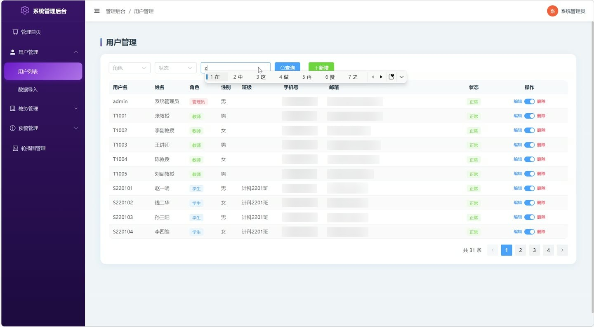
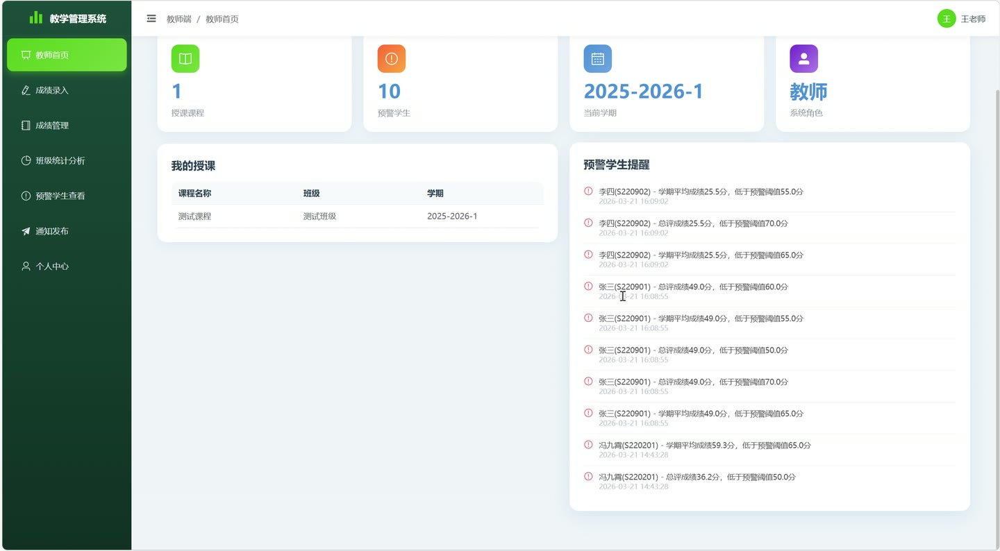
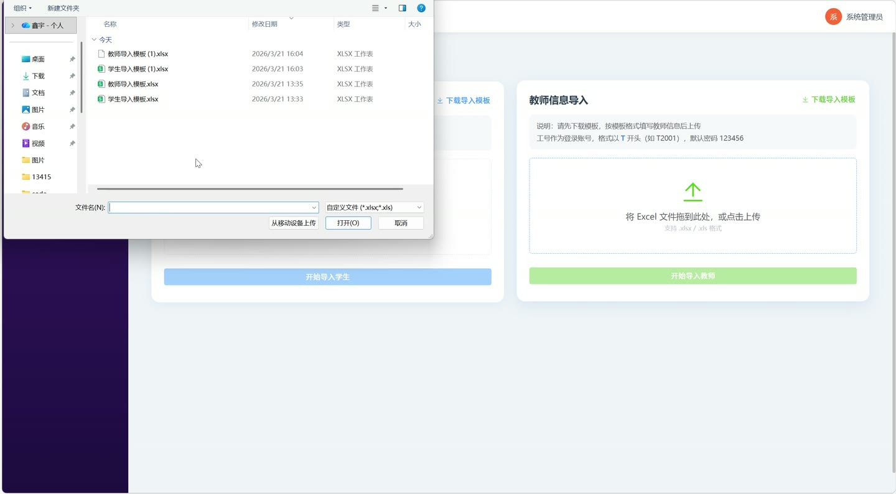
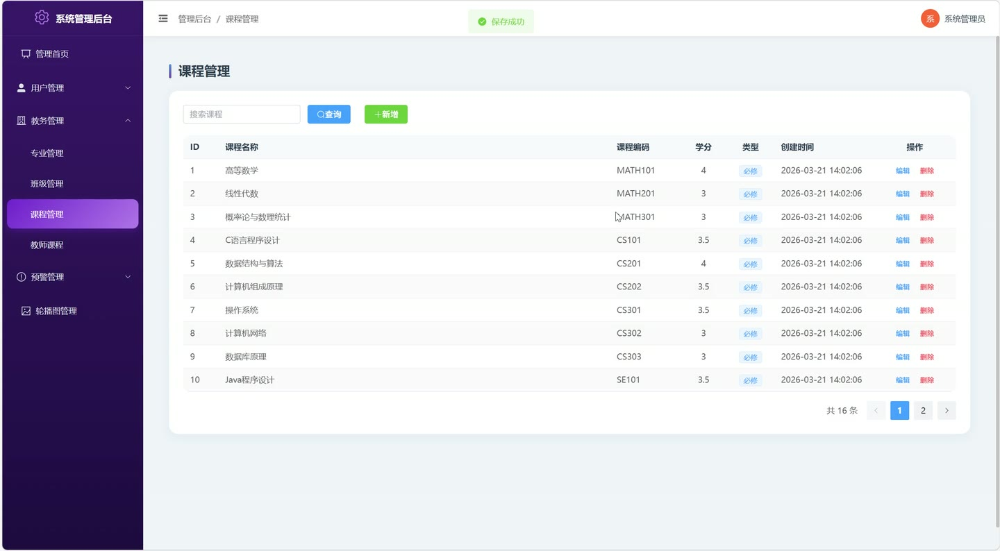
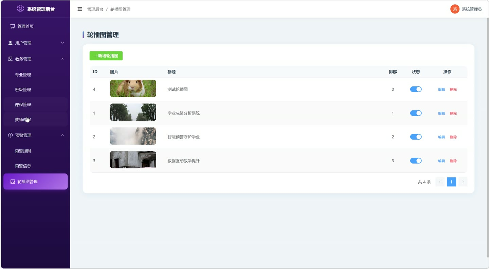
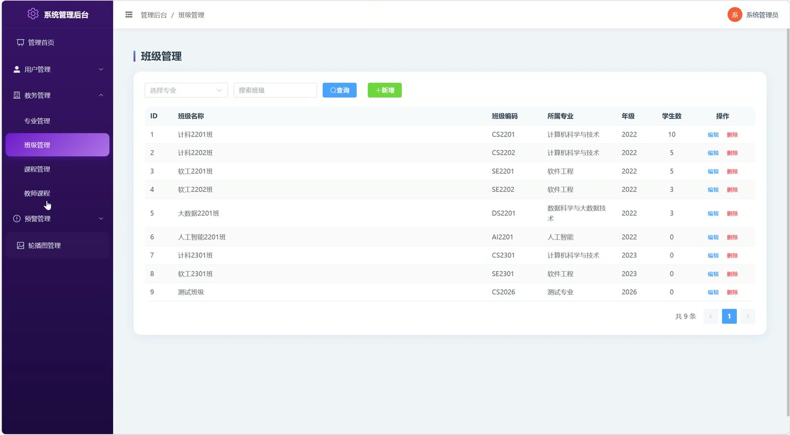

# (附文档)Springboot3+Vue3+MySQL 学生成绩分析与预警系统

**技术栈**：Springboot3、Vue3、MySQL

### 系统简介

本系统是一套基于 Spring Boot 3 + Vue 3 + MySQL 的前后端分离学生成绩分析与预警平台，支持学生、教师、管理员三种角色。学生可查看个人成绩与预警信息，教师可录入和管理所授课程成绩并查看预警学生，管理员则负责基础数据配置、用户管理、预警规则设定及系统轮播图维护。
 
### 核心功能
 
### 普通用户端

 
- 登录/注册：支持学生和教师注册，教师注册后需管理员审核；登录后自动跳转对应角色首页。 
- 个人首页：展示个人基本信息、待处理预警数量、最新通知等统计概览。 
- 成绩查询：查看本人所有学期的课程成绩列表，支持按学期、课程筛选。 
- 成绩统计分析：以图表形式展示各学期各课程的总分、平时分、期中分、期末分，支持成绩趋势折线图。 
- 成绩预警：查看本人触发的预警记录列表，包括预警规则名称、触发课程、学期、当前分数及预警状态。 
- 学业通知：查看管理员或教师发布的系统通知，支持按通知类型筛选。 
- 通知详情：点击通知标题进入详情页，查看完整通知内容。 
- 个人中心：修改个人头像、手机号、邮箱等基本信息。 
- 首页轮播图：查看管理员发布的启用状态的轮播图。
 
### 管理员端

 
- 管理首页：展示系统总览统计，包括学生数、教师数、课程数、班级数、成绩记录数、待处理预警数、通知数。 
- 用户管理：分页查询所有用户（学生/教师/管理员），支持按角色、关键字、班级、状态筛选；新增、编辑、删除用户；审核教师注册（通过/拒绝）；禁用或启用用户账号。 
- 数据导入：下载学生导入模板（Excel）和教师导入模板（Excel）；批量导入学生或教师用户，导入时验证学号/工号格式（学生以S开头、教师以T开头）及唯一性，支持班级ID字段。 
- 专业管理：新增、编辑、删除专业，支持按专业名称/编码搜索，专业编码唯一性校验。 
- 班级管理：新增、编辑、删除班级，支持按班级名称/编码或所属专业筛选，班级编码唯一性校验，列表显示所属专业及学生人数。 
- 课程管理：新增、编辑、删除课程，支持按课程名称/编码搜索，课程编码唯一性校验，设置学分和课程类型。 
- 教师课程分配：为教师分配授课任务（选择教师、课程、班级、学期），避免同一教师同一学期重复分配相同课程和班级。 
- 预警规则管理：新增、编辑、删除预警规则，支持单科成绩预警和学期平均分预警两种类型，设置阈值分数，启用/停用规则。 
- 预警信息管理：查看所有预警记录列表，支持按学生、学期、状态、关键字搜索；处理预警（将状态改为已解除）；删除预警记录。 
- 轮播图管理：新增、编辑、删除首页轮播图，设置标题、图片链接、跳转链接、排序号及启用状态。
 
### 教师端

 
- 教师首页：展示本人授课班级数、课程数、本学期待录入成绩数、预警学生数等统计。 
- 成绩录入：选择本人本学期所授课程和班级，按学生列表逐条录入平时分、期中分、期末分，系统自动按权重（30%平时+20%期中+50%期末）计算总评并触发预警检测。 
- 成绩管理：查看/编辑/删除本人所授课程的成绩记录，支持按学生、课程、班级、学期筛选。 
- 班级统计分析：选择班级和学期，查看该班级各课程的平均分、最高分、最低分、及格率等统计报表。 
- 预警学生查看：查看本人所授班级学生的预警记录，支持按学期、状态筛选，可处理预警。 
- 通知发布：发布学业通知，设置通知标题、内容、类型、封面图及发布状态。 
- 个人中心：修改个人头像、手机号、邮箱等基本信息。
 
### 技术栈

 后端框架Spring Boot 3 ORMMyBatis-Plus 权限Session + 前端路由守卫（角色路由拦截） 前端框架Vue 3 状态管理Vue Router（路由级状态管理） 构建工具Vite 数据库MySQL Excel 处理EasyExcel
 
### 交付内容

 
- 后端完整源码 
- 前端完整源码 
- 数据库初始化脚本 
- 万字文档

## 界面展示

---

## 获取完整源码 + 万字文档

本仓库为项目介绍页。**完整前后端源码、数据库初始化脚本、万字项目文档**，请加微信 `kangkangcode`，或访问 [codekk.top](http://codekk.top) 获取。

可作课程设计 / 毕业设计参考，支持远程部署调试。